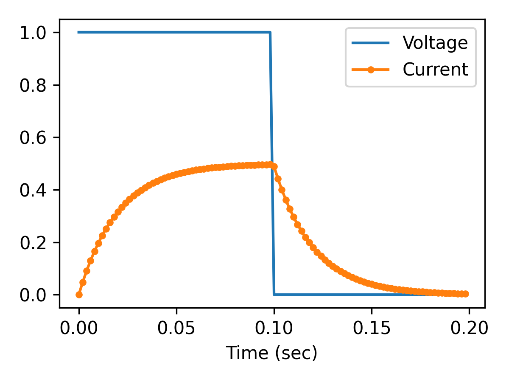

# Example of RK4 ODE Solver in Python

This collection of Python files which implement the popular [RK4 numerical integration method](https://en.wikipedia.org/wiki/Runge%E2%80%93Kutta_methods) and an example differential equation application of a [resistive-inductive (RL) load](https://en.wikipedia.org/wiki/RL_circuit).

The top-level file `simulation.py` simulates an RL circuit using the RK4 method.

## Files

- `simulation.py`---top-level which calls the RK4 ODE solver
- `solver_rk4.py`---implements the step function which approximates the next solution point
- `diff_eq.py`---the RL circuit differential equation
- `applied_voltage.py`---generates a voltage profile as a function of time (steps at 5 Hz)

## Results

Run `python3 simulation.py` to run the simulation.

On the console, the state information will be printed:

```
# time (sec), voltage (V), current (A)
# Step size is 0.01 sec:

0.00 1.0 0.000000000000000
0.01 1.0 0.242798353909465
0.02 1.0 0.367694626496638
0.03 1.0 0.431941680296624
0.04 1.0 0.464990576284271
0.05 1.0 0.481991037183267
0.06 1.0 0.490736130238306
0.07 1.0 0.495234634896248
0.08 1.0 0.497548680502185
0.09 1.0 0.498739033180136
0.10 0.0 0.443795798960976
0.11 0.0 0.228290020041654
0.12 0.0 0.117433137881509
0.13 0.0 0.060407992737402
0.14 0.0 0.031074070338169
# ...
```

With the default code, in the circuit:

- Initial current value at $t=0$ is 0 A
- 1 V voltage is applied at $t=0$.

The circuit time constant $\tau = L/R$ is set at 20 ms. This means the current reaches steady state after about $5\tau$=100 ms.

The resistance is set such that steady-state current with 1 V applied is 0.5 A, i.e., $R=2~\Omega$.


