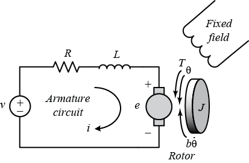

# Motor Modeling + RK4 ODE Solver + Python

This collection of Python files implement the popular [RK4 numerical integration method](https://en.wikipedia.org/wiki/Runge%E2%80%93Kutta_methods) and a few example differential equation applications of electrical and electromechanical systems.

The top-level file `simulation.py` simulates the system using the RK4 method. For the sake of learning, no library functions are used---all equations, solvers, and simulation steps are hand-coded directly in these files.

> For a more structured and complete simulation framework written in Python for electromechanical systems, check out the open-source [`motulator`](https://github.com/Aalto-Electric-Drives/motulator) project from Aalto University in Finland.

## Provided Files

What is provided in this repo?

**Common to all examples:**

- `./simulation.py`---top-level which calls the RK4 ODE solver
- `./solver_rk4.py`---implements the step function which approximates the next solution point

**Example-specific files:**

- `./exampleX/diff_eq.py`---the differential equation for the example application
- `./exampleX/applied_input.py`---generates the applied input profile purely as a function of time

## Running the Simulation

Run `python3 simulation.py` to run the simulation.
On the console, the state information will be printed.

For example, in a scalar system (1 input, 1 output):

```bash
# time (sec), applied input vector, y state vector
# Step size is 0.01 sec:

0.00 [1.0] [0.000000000000000]
0.01 [1.0] [0.242798353909465]
0.02 [1.0] [0.367694626496638]
0.03 [1.0] [0.431941680296624]
0.04 [1.0] [0.464990576284271]
0.05 [1.0] [0.481991037183267]
0.06 [1.0] [0.490736130238306]
0.07 [1.0] [0.495234634896248]
0.08 [1.0] [0.497548680502185]
0.09 [1.0] [0.498739033180136]
0.10 [0.0] [0.443795798960976]
0.11 [0.0] [0.228290020041654]
0.12 [0.0] [0.117433137881509]
0.13 [0.0] [0.060407992737402]
0.14 [0.0] [0.031074070338169]
# ...
```

## Canonical Form for Numerical Integration Methods

Numerical integration methods (like RK4) can be generally applied to systems of this form:

$$
\frac{\mathrm{d} y}{\mathrm{d} t} = f(t,y)
%
\quad\quad\quad\quad
%
y(t_0) = y_\mathrm{init}
$$

where $y$ is the vector of system state and $f$ is a function which describes the derivative of $y$.
In many systems, the derivative equations themselves are not a function of time $t$. Instead, $t$ is used to obtain the input to the system $u$, meaning that $f(t,y)$ could instead be written as $f(u(t),y)$.

If we write our system equations in this form, their solution can be approximated using the solver. Notice that the function $f$, i.e., the system derivative, can be nonlinear and, in general, very complicated. The solver should still work, meaning converge to the solution with limited error.

## Example 1: RL Circuit

> See the example code: `./e01_rl_circuit/...`

Let's model a resistive-inductive (RL) circuit:


The governing equations which relate current $i$ and voltage $v$ are:

$$
v(t) = R i(t) + L \frac{\mathrm{d} i(t)}{\mathrm{d} t}
$$

Isolate the derivative as:

$$
\frac{\mathrm{d} i(t)}{\mathrm{d} t} = \frac{1}{L} v(t) - \frac{R}{L} i(t)
$$

Or, in general form:

$$
y = \begin{bmatrix}
i
\end{bmatrix},\quad
%
u = \begin{bmatrix}
v
\end{bmatrix},\quad
%
f(t,y) = \frac{1}{L} u(t) - \frac{R}{L} y
$$

### Steady-State Analysis

We can solve for the steady-state operating point by setting our differential equation to 0, meaning the state is not changing.

$$
0 = \frac{\mathrm{d} i(t)}{\mathrm{d} t} = \frac{1}{L} v(t) - \frac{R}{L} i(t)
$$

Assuming a constant voltage applied $v(t) = V_{ss}$, solve for the current in steady-state $i(t) = I_{ss}$:

$$
\begin{align}
0 = \frac{\mathrm{d} i(t)}{\mathrm{d} t} &= \frac{1}{L} v(t) - \frac{R}{L} i(t) \\
0 &= \frac{1}{L} V_{ss} - \frac{R}{L} I_{ss} \\
I_{ss} &= \frac{1}{R} V_{ss}
\end{align}
$$

This result matches our intuition: in steady-state, the inductive part of the RL circuit vanishes and the system is simply governed by [Ohm's law](https://en.wikipedia.org/wiki/Ohm%27s_law): $V = IR$.

### Example Model Parameters

| Parameter | Symbol | Value | Units |
| --- | --- | --- | --- |
| Resistance | $R$ | 2 | $\Omega$ |
| Inductance | $L$ | 0.04 | H |

### Results

With the example code provided, in the circuit:

- Initial current value at $t=0$ is 0 A
- 1 V voltage is applied at $t=0$.

The circuit time constant $\tau = L/R$ is set at 20 ms. This means the current reaches steady state after about $5\tau$=100 ms.

The resistance is set such that steady-state current with $V_{ss} = 1$ V applied is $I_{ss} = 0.5$ A, i.e., $R=2~\Omega$.


## Example 2: DC Motor

> See the example code: `./e02_dc_motor/...`

To a user, the DC motor can be thought of a black-box system. Consider the motor pictured below with no load attached to it. The user starts by applying a DC voltage across its two terminals. Current then flows into the motor from the source. The motor will accelerate and reach a steady-state speed. These three items (voltage, current and speed) are all interrelated. Understanding the relationship is possible by examining the differential equations which govern the system.

DC motors can be modeled as a system with two parts: electrical and mechanical. Governing equations can be written for each system individually, and then coupling equations relate states in each system together.


### Electrical System

The electrical system of a DC motor looks like the RL circuit above, but also includes a back-EMF term $e(t)$ due to the winding being exposed to a time-varying magnetic flux (see [Lenz's law](https://en.wikipedia.org/wiki/Lenz%27s_law)). The back-EMF voltage only appears when the motor is spinning.

$$
v(t) = R i(t) + L \frac{\mathrm{d} i(t)}{\mathrm{d} t} + e(t)
$$

### Mechanical System

The mechanical system assumes a torque source $\tau_\mathrm{em}(t)$ coming from the motor and a load torque $\tau_\mathrm{load}(t)$ being applied externally. Then, it models how the total torque interacts with the rotating mass with inertia $J$, rotating at angular speed $\omega$. Viscous damping $b$ acts as a loss mechanism:

$$
\tau_\mathrm{em}(t) - \tau_\mathrm{load}(t) = b \omega(t) + J \frac{\mathrm{d} \omega(t)}{\mathrm{d} t}
$$

Notice the duality compared to the electrical system: both $R$ and $b$ model damping (i.e., loss) elements, and both $L$ and $J$ model energy storage elements.

### Electromechanical Cross-Coupling

When the motor spins, the non-zero speed $\omega(t)$ creates a back-EMF $e(t)$ according to the motor back-EMF constant $k_\mathrm{e}$. This couples the mechanical system to the electrical system:

$$
e(t) = k_\mathrm{e} \omega(t)
$$

When current $i(t)$ flows in the motor, electromagnetic torque $\tau_\mathrm{em}(t)$ is created according to the motor torque constant $k_\mathrm{t}$. This couples the electrical system to the mechanical system:

$$
\tau_\mathrm{em}(t) = k_\mathrm{t} i(t)
$$

Note that these motor constants, $k_\mathrm{e}$ and $k_\mathrm{t}$, are purely a function of the motor design. They are constant for a given motor.
Furthermore, both constants are actually describing the same physical phenomenon, meaning they are linearly coupled together---if you increase $k_\mathrm{e}$, you also increase $k_\mathrm{t}$. In fact, in SI units, the numerical values of both constants are the same. In other words, the more back-EMF the motor creates for a given speed, the more torque it will create for a given current.

### Full Model



Combining the above relations give the governing differential equations of the DC motor:

$$
\begin{align}
v(t) &= R i(t) + L \frac{\mathrm{d} i(t)}{\mathrm{d} t} + k_\mathrm{e} \omega(t)
\\
k_\mathrm{t} i(t) - \tau_\mathrm{load}(t) &= b \omega(t) + J \frac{\mathrm{d} \omega(t)}{\mathrm{d} t}
\end{align}
$$

Isolating the derivatives:

$$
\begin{align}
\frac{\mathrm{d} i(t)}{\mathrm{d} t} &= \frac{1}{L} v(t) - \frac{R}{L} i(t) - \frac{k_\mathrm{e}}{L} \omega(t)
\\
\frac{\mathrm{d} \omega(t)}{\mathrm{d} t} &= -\frac{1}{J} \tau_\mathrm{load}(t) - \frac{b}{J} \omega(t) + \frac{k_\mathrm{t}}{J} i(t)
\end{align}
$$

Or, in general form:

$$
y = \begin{bmatrix}
y_1\\
y_2
\end{bmatrix} =
\begin{bmatrix}
i\\
\omega
\end{bmatrix}, \quad
%
u = \begin{bmatrix}
u_1\\
u_2
\end{bmatrix} =
\begin{bmatrix}
v\\
\tau_\mathrm{load}
\end{bmatrix}, \quad
%
f(t,y) =
\begin{bmatrix}
\frac{1}{L} u_1(t) - \frac{R}{L} y_1 - \frac{k_\mathrm{e}}{L} y_2 \\
-\frac{1}{J} u_2(t) - \frac{b}{J} y_2 + \frac{k_\mathrm{t}}{J} y_1
\end{bmatrix}
$$

### Steady-State Analysis

We can solve for the steady-state operating point by setting our differential equation to 0, meaning the states are not changing.

$$
\begin{align}
0 = \frac{\mathrm{d} i(t)}{\mathrm{d} t} &= \frac{1}{L} v(t) - \frac{R}{L} i(t) - \frac{k_\mathrm{e}}{L} \omega(t) \\
0 = \frac{\mathrm{d} \omega(t)}{\mathrm{d} t} &= -\frac{1}{J} \tau_\mathrm{load}(t) - \frac{b}{J} \omega(t) + \frac{k_\mathrm{t}}{J} i(t)
\end{align}
$$

Assume a constant voltage applied $v(t) = V_{ss}$ and load torque $\tau_\mathrm{load}(t) = T_{\mathrm{load},ss}$.

Then, solve for the current and speed in steady-state: $i(t) = I_{ss}$ and $\omega(t) = \Omega_{ss}$:

$$
\begin{align}
0 &= \frac{1}{L} V_{ss} - \frac{R}{L} I_{ss} - \frac{k_\mathrm{e}}{L} \Omega_{ss} \\
0 &= -\frac{1}{J} T_{\mathrm{load},ss} - \frac{b}{J} \Omega_{ss} + \frac{k_\mathrm{t}}{J} I_{ss}
\end{align}
$$

After solving the system of equations:

$$
\begin{align}
I_{ss} &= V_{ss} \frac{1}{\left(\frac{k_\mathrm{e} k_\mathrm{t}}{b} + R \right)} + T_{\mathrm{load},ss} \frac{1}{\left( \frac{b R}{k_\mathrm{e}} + k_\mathrm{t} \right)} \\
\Omega_{ss} &= V_{ss} \frac{1}{\left(\frac{b R}{k_\mathrm{t}} + k_\mathrm{e}\right)} - T_{\mathrm{load},ss} \frac{1}{\left( \frac{k_e k_t}{R} + b \right)}
\end{align}
$$

Now, let's examine these results under an extreme case:

Consider the mechanical damping $b$ goes to 0, i.e., a frictionless system, and the applied load torque $T_{\mathrm{load},ss} = 0$. Then:

- The steady-state speed becomes $\Omega_{ss} = V_{ss} / k_\mathrm{e}$.
- The steady-state current becomes $I_{ss} = 0$.

This operating point is called the theoretical no-load speed and current: at this idealized no-load, the motor will accelerate up to the voltage limit (i.e., applied voltage). At this point, the motor's back-EMF matches the applied voltage, so no current flows. Since no current flows, no torque is created, so the speed is in steady-state. In real systems, the damping $b$ is never 0, thus the motor never reaches its ideal no-load speed due to mechanical loss.

### Example Motor Specifications

The following specifications and parameters model the popular [775 size DC motor (12 V, not geared version)](https://www.google.com/search?q=dc+motor+775+12v), which is what was pictured above.
Note that, depending on the vendor, these parameters might vary. However, these values provide a good baseline representative model of the motor.

| Specification | Symbol | Value | Units |
| --- | --- | --- | --- |
| Rated Voltage | $V_\mathrm{rated}$ | 12 | V |
| No-Load Speed | $N_\mathrm{no-load}$ | 12000 | RPM |
| No-Load Current | $I_\mathrm{no-load}$ | 1.2 | A |
| Stall Current | $I_\mathrm{stall}$ | 42.4 | A |

Based on the above specs, combined with assumptions on the electrical and mechanical time constants, the full model parameters can be derived.

The armature winding resistance $R$ can be directly computed based on the stall current:

$$
R = \frac{V_\mathrm{rated}}{I_\mathrm{stall}}
$$

Based on the other motor specifications (no-load current and speed, stall current), the mechanical damping constant $b$ and the motor constant $k_\mathrm{e}$ and $k_\mathrm{t}$ can be computed:

$$
\begin{align}
b &= \frac{V_\mathrm{rated} I_\mathrm{no-load}}{\Omega_\mathrm{no-load}^2} - \frac{V_\mathrm{rated} I_\mathrm{no-load}^2}{\Omega_\mathrm{no-load}^2 I_\mathrm{stall}} \\
k_e = k_t &= \frac{V_\mathrm{rated}}{\Omega_\mathrm{no-load}} - \frac{V_\mathrm{rated} I_\mathrm{no-load}}{\Omega_\mathrm{no-load} I_\mathrm{stall}}
\end{align}
$$

where $\Omega_\mathrm{no-load}$ is the no-load speed in $\frac{\mathrm{rad}}{\mathrm{sec}}$ based on $N_\mathrm{no-load}$, i.e., $\Omega_\mathrm{no-load} = \frac{2\pi}{60} N_\mathrm{no-load}$.

Now, all the steady-state parameters are known. The armature winding inductance $L$ and rotor inertia $J$ determine the dynamic performance and cannot be estimated directly from the given specifications.

However, we can estimate the $L$ and $J$ values based on typical electrical and mechanical time constants: $\tau_\mathrm{e} = L/R$ and $\tau_\mathrm{m} = J/b$. Typically, $\tau_\mathrm{e} \ll \tau_\mathrm{m}$. Here, we assume $\tau_\mathrm{e}$ is 5 ms and $\tau_\mathrm{m}$ is 60x slower.

### Example Model Parameters

Based on the above motor specifications, equations, and assumptions, the following table lists the full model parameters:

| Parameter | Symbol | Value | Units |
| --- | --- | --- | --- |
| Resistance | $R$ | 2.83e-01 | $\Omega$ |
| Inductance | $L$ | 1.42e-03 | $\mathrm{H}$ |
| Inertia | $J$ | 2.66e-06 | $\mathrm{kg}~\mathrm{m}^2$ |
| Damping | $b$ | 8.86e-06 | $\frac{\mathrm{Nm}}{\mathrm{rad/s}}$ |
| Back-EMF constant | $k_\mathrm{e}$ | 9.28e-03 | $\frac{\mathrm{V}}{\mathrm{rad/s}}$ |
| Torque constant | $k_\mathrm{t}$ | 9.28e-03 | $\frac{\mathrm{Nm}}{\mathrm{A}}$ |

### Results

> TODO: in progress...

## Example 3: 3-Phase Induction Motor (IM)

> TODO: in progress...

## Example 4: 3-Phase Permanent Magnet Synchronous Motor (PMSM)

> TODO: in progress...
